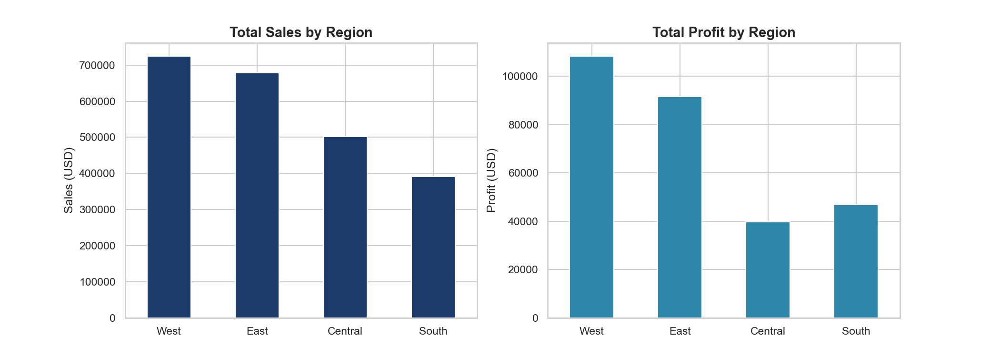
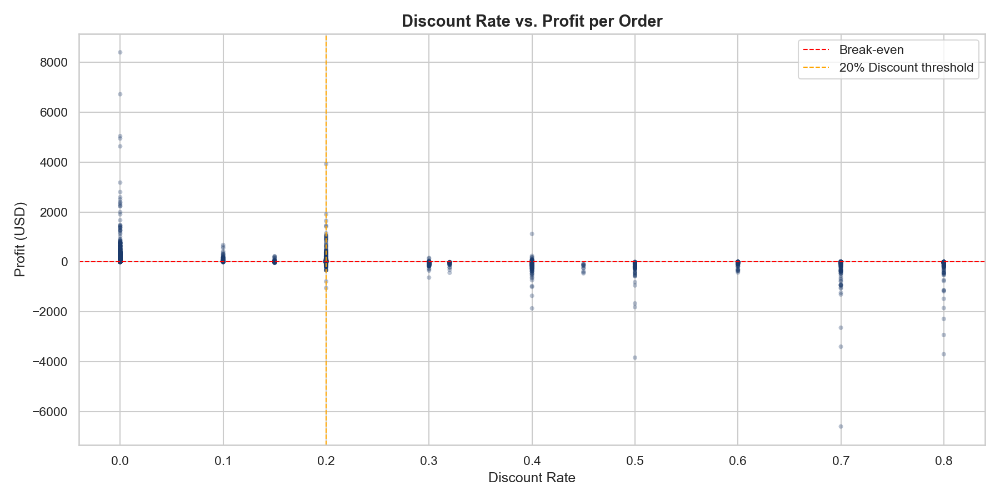
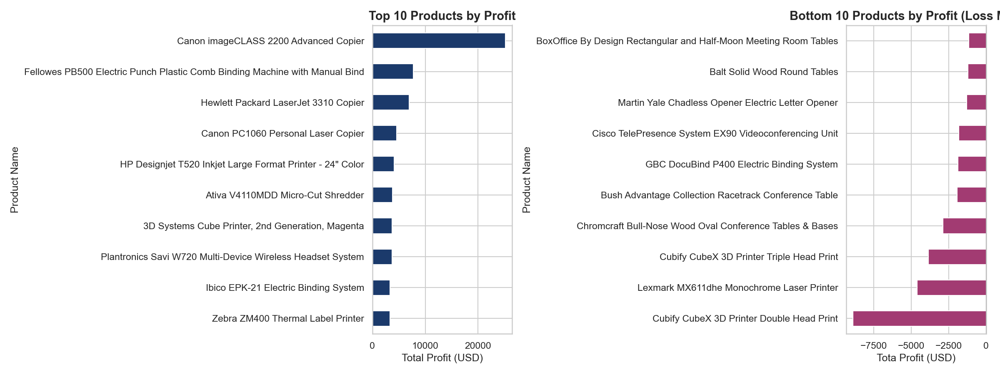
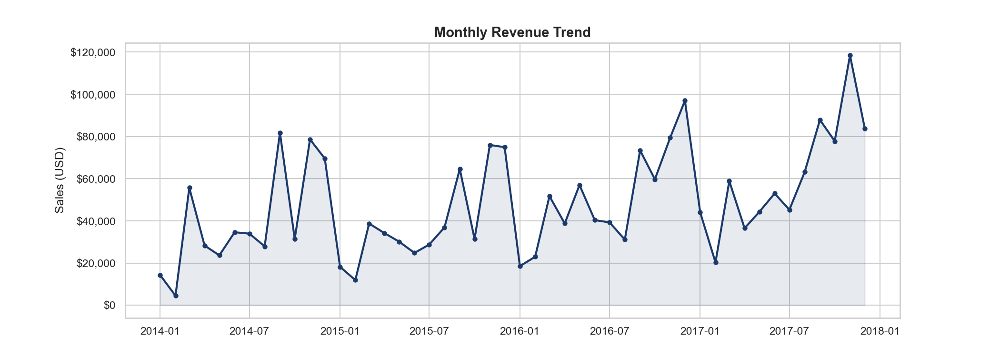
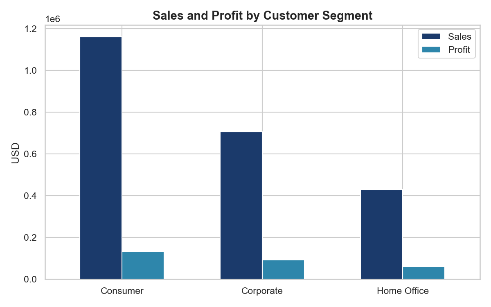

# Redoing Entire Analysis Project on GitHub to learn Version Control

Data Analysis project using Superstore Dataset from Kaggle containing 9,994 rows of information to extract insights on sales profitability.

Files included:
1. 01_data_cleaning.ipynb
2. 02_eda.ipynb
3. superstore.csv
4. superstore_clean.csv

5. regional_sales_profit.png

6. category_margin.png

7. discount_vs_profit.png

8. top_bottom_products.png

9. monthly_trend.png

10. segment_performance.png

